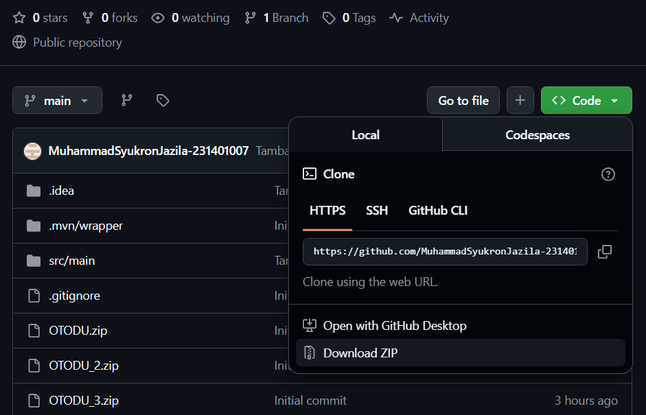
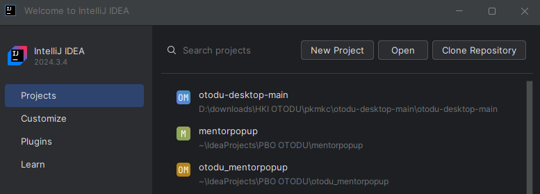
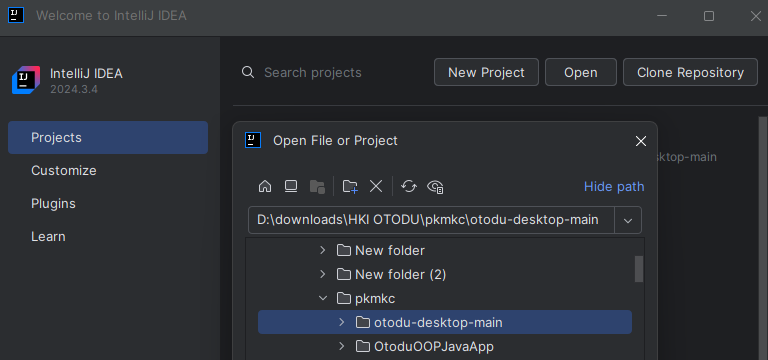
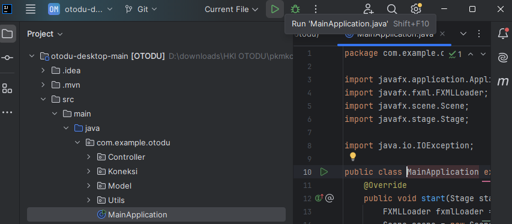
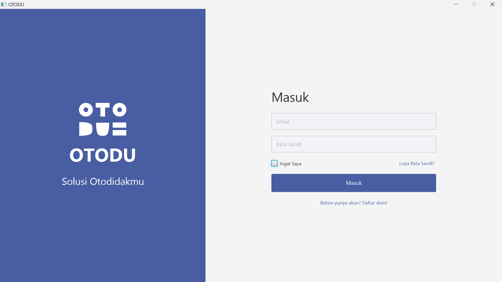
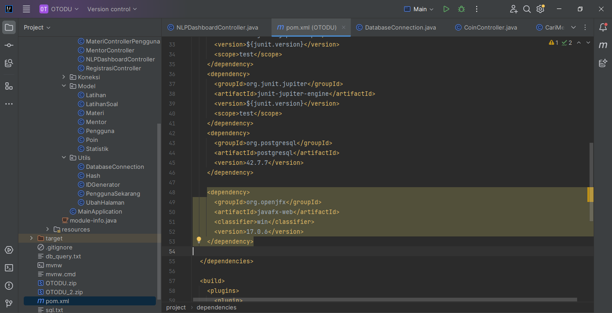

# OTODU: Sistem Pembelajaran Berbasis Quis dan Mentor

Otodu adalah aplikasi edukasi berbasis kuis dan sistem mentor yang dirancang untuk membantu pelajar belajar secara mandiri dengan cara yang lebih hemat, fleksibel, dan menyenangkan. Otodu menyediakan berbagai materi pembelajaran yang bisa diakses menggunakan sistem koin, sehingga pengguna bisa memilih dan membeli hanya materi yang mereka butuhkan. Dengan adanya sistem ini, pengguna tidak perlu membayar untuk seluruh materi jika hanya membutuhkan sebagian.

Setiap materi disertai dengan kuis interaktif untuk menguji pemahaman, dan pengguna akan mendapatkan poin dari hasil belajar dan mengerjakan soal. Poin ini akan dimasukkan ke dalam leaderboard, dan setiap minggunya, lima pengguna teratas akan mendapatkan koin gratis yang bisa digunakan untuk melanjutkan belajar. Selain itu, tersedia fitur pencarian mentor terdekat, yang memungkinkan pengguna berkonsultasi langsung jika mengalami kesulitan dalam memahami materi tertentu.

Otodu tidak hanya mendorong pengguna untuk belajar, tetapi juga membangun kebiasaan belajar mandiri yang fleksibel.

# Fitur Utama
Adapun fitur utama OTODU dijabarkan sebagai berikut.
## Sistem Koin untuk Pembelajaran
Pengguna harus membeli koin untuk membuka materi atau mengerjakan kuis.
Sistem ini memungkinkan pengguna hanya mengakses materi yang mereka butuhkan, sehingga lebih hemat dibandingkan berlangganan penuh.
Koin bisa dibeli, atau diperoleh melalui pencapaian seperti masuk leaderboard.

## Kuis Interaktif
Setiap materi dilengkapi kuis untuk menguji pemahaman.
Soal kuis terdiri dari berbagai jenis: pilihan ganda, isian singkat, dan pertanyaan logika sederhana.
Hasil kuis akan menambah poin pengguna.

## Leaderboard Mingguan
Peringkat siswa dengan poin tertinggi ditampilkan di leaderboard.
Setiap minggu, lima siswa teratas akan mendapatkan bonus koin gratis sebagai penghargaan, yang dapat digunakan untuk belajar materi lain.

## Sistem Poin dan Evaluasi
Poin diberikan berdasarkan jumlah materi yang dipelajari dan hasil pengerjaan kuis.
Semakin aktif dan tepat belajar, semakin tinggi poin yang dikumpulkan.
Evaluasi dilakukan setiap minggu dan poin akan di-reset untuk menciptakan kesempatan baru bagi pengguna lainnya.

## Fitur Cari Mentor Terdekat
Pengguna dapat mencari dan menghubungi mentor yang lokasinya paling dekat, untuk membantu menyelesaikan soal atau menjelaskan materi.

## Riwayat dan Progress Belajar
Pengguna bisa melihat sejauh mana progres belajarnya dari dashboard

# Cara menjalankan aplikasi

## Download file .zip pada repository Github ini



## Unzip file tersebut 

File yang telah didownload kemudian di unzip.

## Buka Intellij lalu klik open



## Buka dan cari direktori file OTODU yang telah di-unzip sebelumnya



## Pada tab kiri, buka direktori: src/main/java/com.example.otodu/MainApplication kemudian klik tombol "Play" berbentuk segitiga di atas



## Masukkan email dan password yang sesuai untuk siswa dan admin

Akun siswa:
Email: tes@gmail.com
Password: tes

Akun admin:
Email: john@gmail.com
Password: tes



# Install Dependecies

Silahkan masukkan dependecy berikut pada file pom.xml. lalu silahkan install.

```
<dependency>
  <groupId>org.postgresql</groupId>
  <artifactId>postgresql</artifactId>
  <version>42.7.7</version>
</dependency>
<dependency>
  <groupId>org.openjfx</groupId>
  <artifactId>javafx-web</artifactId>
  <classifier>win</classifier>
  <version>17.0.6</version>
</dependency>
```



# Video Presentasi
https://youtu.be/Xb3_86rXaxM

